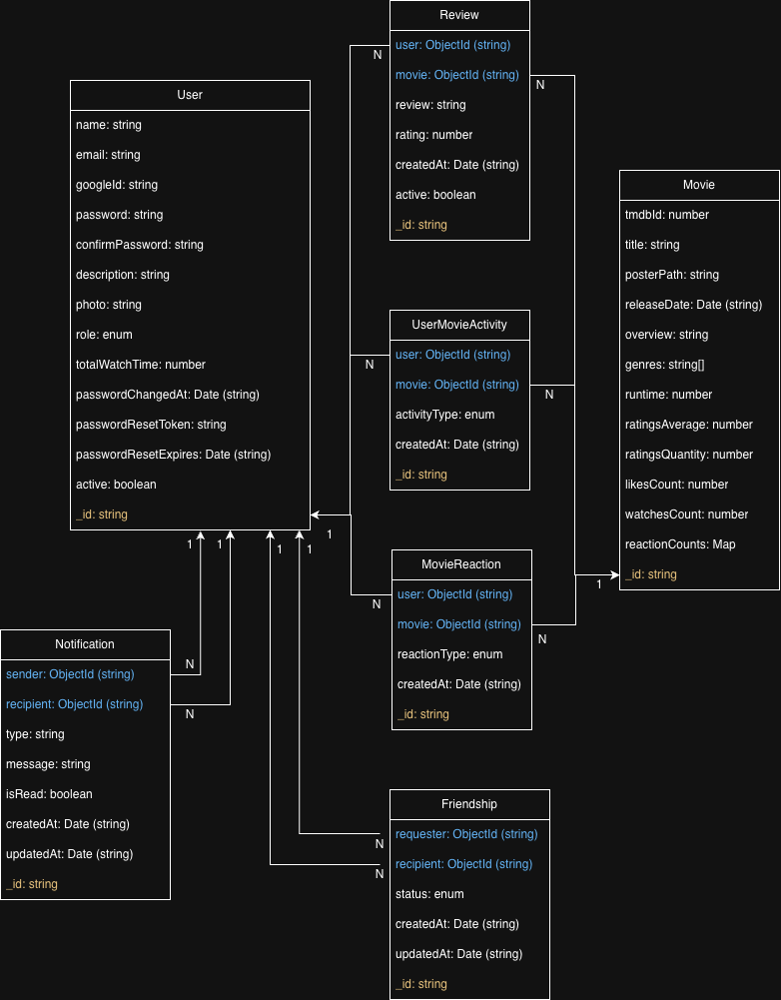

# 🎬 RecApp Backend API

## 🗄️ Архітектура бази даних (ER-діаграма)
Система побудована на реляційній логіці в рамках NoSQL бази даних MongoDB з використанням проміжних колекцій (зв'язуючих таблиць) для забезпечення консистентності даних.

